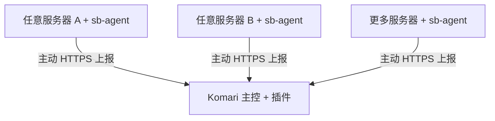

# Komari Sing-box Monitor

[](https://github.com/K23Flux/komari-singbox-monitor/actions/workflows/ci.yml)
[](https://github.com/K23Flux/komari-singbox-monitor/releases)
[](LICENSE)

一个面向 [Komari](https://github.com/komari-monitor/komari) 的只读型 Sing-box 集中监控插件。

Komari 继续负责 CPU、内存、磁盘和在线状态；本项目专门展示多台服务器的 Sing-box inbound、端口流量、实时速度、运行状态与异常日志。节点名称由你添加时自行填写，Agent 可通用于任意符合要求的服务器，不与任何固定服务器名称绑定。

> [!IMPORTANT]
> 项目处于早期开发阶段。首次部署前请阅读“统计口径”和“安全边界”，并先在非关键服务器验证。

## 功能

- 在 Komari 管理后台直接使用，无需另建第二套面板
- 自定义节点名称，一次性注册密钥，新增服务器流程类似 Komari Agent
- 固定只读解析 `/etc/sing-box/config.json`
- 自动发现 inbound 的端口、协议、tag 和用户名
- 使用独立 nftables table 统计 TCP/UDP 端口上下行字节
- 展示当前速度、今日流量、本月流量和分钟历史
- 展示 Sing-box 运行状态、版本和 Agent 最后上报时间
- 采集 systemd journal 中 WARN 及以上日志
- 支持节点改名、端口显示别名和删除节点
- 自动同步 Komari 深色/浅色主题
- Agent 支持 Linux amd64、arm64

## 验证状态与当前限制

自动测试使用模拟的 Komari 接口，不等同于在 Komari goja 沙箱中的实际验收。首版按预发布处理；尚未在真实 VPS 上完成安装、重启、断网恢复和升级测试，不能承诺零缺陷。

### 升级 Agent

先更新主控插件，再在各被监控机器执行：

```bash
curl -fsSL https://你的Komari域名/api/sbmonitor/v1/install.sh | bash -s -- --update --server https://你的Komari域名
```

升级保留节点身份和累计状态。启动检查失败会恢复旧 Agent 二进制；这不是完整的业务健康检查。不要重复执行首次注册命令。

- 一个端口对应一个用户时，端口流量可近似视为该用户流量。
- 多个用户共用一个端口时，V0.1 只能显示端口总流量，无法按用户拆分。
- V0.1 不提供实时连接、目标域名排行或用户级 Statistics API 数据。
- 只支持 systemd 系统，尚未支持 OpenRC、Docker 内单独运行的 Sing-box 等环境。
- Sing-box 配置必须是标准 JSON，不支持 JSONC 注释。

## 工作方式



每台服务器上的 `sb-agent` 主动访问 Komari，因此目标服务器不需要开放新的管理端口。详细设计见 [架构说明](docs/ARCHITECTURE.md)。

## 环境要求

### Komari 主控

- Komari `1.4.3` 或更高版本
- 可安装并启用 Komari 原生插件
- Agent 能访问 Komari 的 HTTP(S) 地址

### 被监控服务器

- Debian、Ubuntu 或其他使用 systemd 的 Linux
- `amd64` 或 `arm64`
- root 权限
- 配置固定存在于 `/etc/sing-box/config.json`
- 默认服务名为 `sing-box.service`
- nftables、curl、sha256sum、systemctl、install

## 安装

### 1. 下载插件

打开 [Releases](https://github.com/K23Flux/komari-singbox-monitor/releases)，下载插件 ZIP 和对应的 `.sha256` 文件。请勿使用 GitHub 自动生成的 Source code ZIP。

```bash
sha256sum -c komari-singbox-monitor-x.y.z.zip.sha256
```

### 2. 安装到 Komari

1. 登录 Komari 管理后台。
2. 打开“插件”。
3. 选择本地安装并上传 ZIP。
4. 审核权限后启用插件。
5. 从侧边栏的插件分组打开“Sing-box 监控”。

| 权限 | 用途 |
|---|---|
| `node` | 使用插件沙箱内的文件、路径和加密兼容模块 |
| `allowRoutes` | 提供 Agent 注册、上报、安装文件和管理数据接口 |

插件不申请系统 RPC、执行命令、全盘文件、HTML 注入、WebSocket Hook 或额外端口监听权限。

### 3. 添加任意服务器

1. 在插件页面点击“添加节点”。
2. 输入你希望显示的任意名称。
3. 点击生成安装命令。
4. 将命令复制到目标服务器，以 root 身份执行。

安装脚本会检查固定配置路径、识别架构、下载并校验 Agent、注册节点、创建 systemd 服务，并建立只计数的 nftables 规则。以后新增任何服务器都重复这一流程，名称自行填写，不需要修改源码。

## Agent 管理

安装后的文件：

```text
/usr/local/bin/sb-agent
/etc/sb-agent/config.json
/var/lib/sb-agent/state.json
/etc/systemd/system/sb-agent.service
```

常用命令：

```bash
systemctl status sb-agent
journalctl -u sb-agent -f
sb-agent once
sb-agent version
```

卸载：

```bash
curl -fsSL https://你的Komari域名/api/sbmonitor/v1/uninstall.sh | bash
```

默认保留 `/etc/sb-agent` 与 `/var/lib/sb-agent`，避免误删身份和累计数据。确认不再使用后可手动删除。

## 统计口径

公网部署必须使用有效 HTTPS，HTTP 只适合可信隔离测试网络。不要公开管理日志：异常日志原文可能包含目标地址、用户名甚至应用写入的敏感内容，当前没有完整自动脱敏能力。

端口按端口号合并，不能区分同端口不同监听 IP 或不同用户。容器转发、NAT、端口复用不在首版准确统计范围。断网期间累计量会在重连时补入接收当天，不能精确分摊到离线日期。Agent 约 30 秒保存一次本地累计状态，突发断电或计数器部分重置仍可能导致误差，不用于计费。

Agent 创建独立的 `inet sbmonitor` nftables table，仅包含 `counter` 规则：

- 上传：到达 Sing-box 监听端口的 TCP/UDP 字节
- 下载：从 Sing-box 监听端口发出的 TCP/UDP 字节

这些数字是线路字节数，包含少量 IP、TCP/UDP、代理协议和加密开销，不等于应用层有效载荷。插件从安装完成后开始统计，不能补回安装前的数据。检测到重启导致原始计数归零时，Agent 会从新计数继续累计。

## 数据保留

- 实时上报默认每 5 秒一次。
- 分钟历史默认保留 30 天，可在插件设置中调整为 1–365 天。
- WARN/ERROR 事件最多保留最近 500 条。
- 今日和本月按 UTC 偏移划分，默认 `UTC+8`。
- 默认超过 60 秒未上报即判定离线。

插件数据保存在 Komari 分配的独立长期存储目录。更新插件不会清空数据；卸载插件前请自行备份。

## 安全边界

- 不读取 `/etc/sing-box/config.json` 以外的代理配置。
- 只上传端口、协议、tag、用户名、流量和状态。
- 不上传 Shadowsocks 密码、VLESS UUID、Reality 私钥或完整配置。
- Agent 不接受远程 Shell、任意命令、配置写入或重启 Sing-box 指令。
- 每个 Agent 使用独立 Token；服务端只保存其 SHA-256 摘要。
- 注册密钥 10 分钟后失效，并且只能使用一次。
- nftables 规则没有 DROP、REJECT、ACCEPT、NAT、MARK 或限速动作。

发现安全问题请阅读 [SECURITY.md](SECURITY.md)，不要把密钥或漏洞细节公开到 Issue。

## 故障排查

### 插件安装失败

- 确认上传的是 Release ZIP，而不是 Source code ZIP。
- 确认 ZIP 根目录直接包含 `komari-plugin.json`。
- 确认 Komari 版本满足要求。
- 在 Komari 插件管理页查看 `last_error` 和插件日志。

### 找不到或无法解析配置

```bash
ls -l /etc/sing-box/config.json
sing-box check -c /etc/sing-box/config.json
```

项目不会自动搜索其他路径，也不会修改配置。

### Agent 启动失败或节点离线

```bash
systemctl status sb-agent --no-pager
journalctl -u sb-agent -n 100 --no-pager
curl -I https://你的Komari域名
```

如果 Komari 使用反向代理，请确保 `/api/sbmonitor/v1/` 没有被额外鉴权或拦截。

### 有端口但没有流量

```bash
nft list table inet sbmonitor
systemctl restart sb-agent
```

确认客户端连接的是对应 `listen_port`，并确认主机允许创建 nftables table。

## 从源码构建

需要 Go 1.22+、Node.js 20+、zip 和 sha256sum：

```bash
git clone https://github.com/K23Flux/komari-singbox-monitor.git
cd komari-singbox-monitor
make test
make build
```

构建会执行 Go 测试和 `go vet`、构建 amd64/arm64 Agent、执行插件集成测试并打包可安装 ZIP。版本号自动读取 `plugin/komari-plugin.json`，产物位于 `dist/`。

## 项目结构

```text
├── agent/                    # Go Agent 源码和测试
├── plugin/                  # Komari 插件、页面与安装脚本
├── tests/                   # 插件集成测试
├── docs/                    # 架构文档
├── .github/workflows/       # CI 与 Release 自动构建
├── build.sh
└── Makefile
```

## 发布版本

更新插件清单和更新日志后创建匹配版本的标签：

```bash
git tag v0.1.0
git push origin v0.1.0
```

GitHub Actions 会自动测试、构建并将 ZIP 与校验文件上传到 Release。

## 路线图

- [x] 通用 Agent 与自定义节点名称
- [x] 端口流量、实时速度、日/月汇总
- [x] 服务状态和 WARN/ERROR 日志
- [ ] 可选 Sing-box API / Clash API 实时连接
- [ ] 用户级流量统计
- [ ] 流量额度与 Webhook/Telegram 告警
- [ ] 小时/日长期聚合
- [ ] 英文管理界面

## 贡献与许可

欢迎提交 Issue 和 Pull Request。开始前请阅读 [CONTRIBUTING.md](CONTRIBUTING.md)。本项目使用 [MIT License](LICENSE)。
