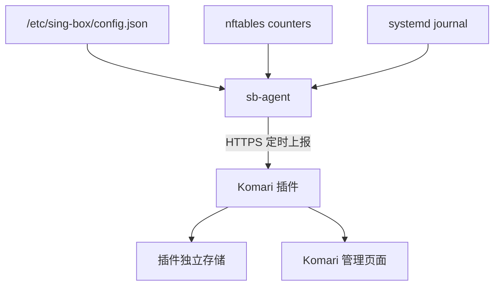

# 架构说明

Komari 继续负责 CPU、内存、磁盘等整机监控，本项目只补充 Sing-box 代理层数据。

## 组成

1. **Komari 插件**：运行在 Komari 的插件沙箱中，提供管理页面、Agent 注册/上报接口和持久化数据。
2. **sb-agent**：安装在每台 Sing-box 服务器上，主动通过 HTTP(S) 向 Komari 上报。
3. **nftables counter**：按 inbound 监听端口统计 TCP/UDP 上下行字节，不改变报文处理结果。

## 数据流

## 身份认证

- 管理员先在插件页面创建 10 分钟有效、仅可使用一次的注册密钥。
- Agent 注册成功后获得独立长期 Token；服务端只保存其 SHA-256 摘要。
- Agent 后续使用 Bearer Token 上报。
- 管理 API 只接受 Komari 管理员身份，并拒绝浏览器跨站请求。

## 流量口径

上传指客户端发往服务器监听端口的字节，下载指服务器从监听端口发往客户端的字节。统计包含 TCP/IP、代理协议和加密等线路开销，因此不会与应用层有效载荷完全一致。

一个端口存在多个用户时，nftables 无法区分用户，本版本只展示该端口总量。
